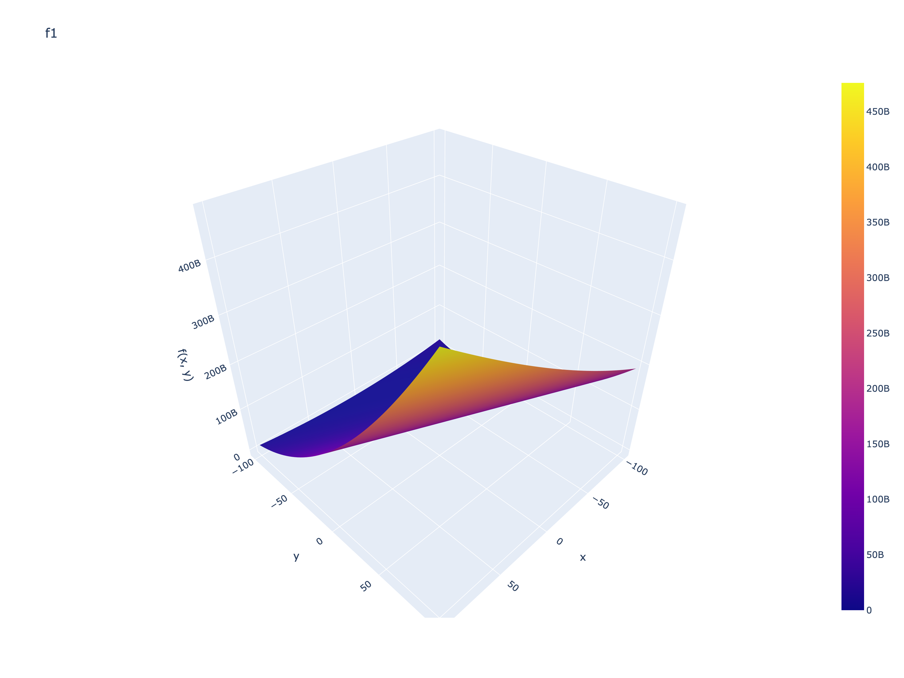
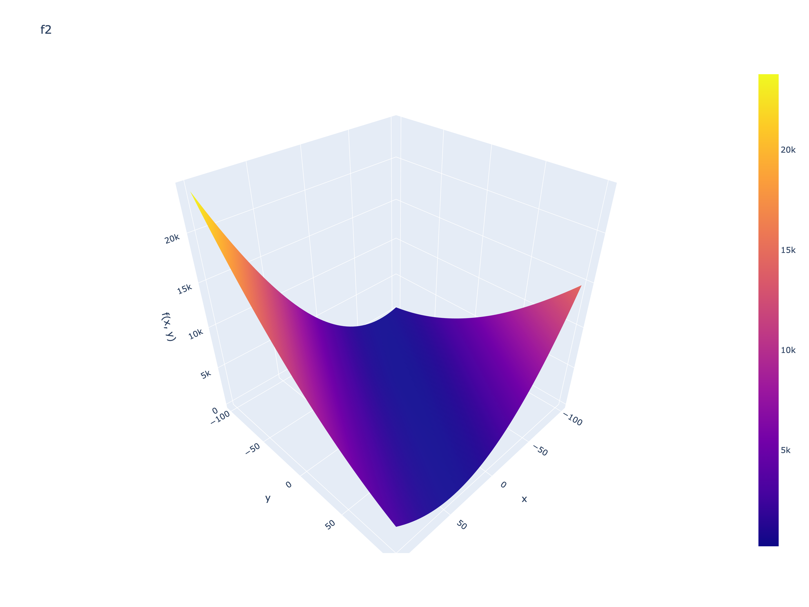
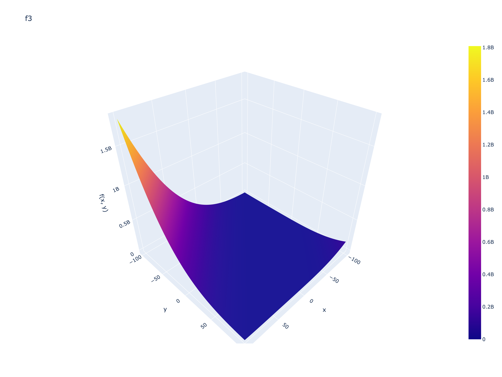
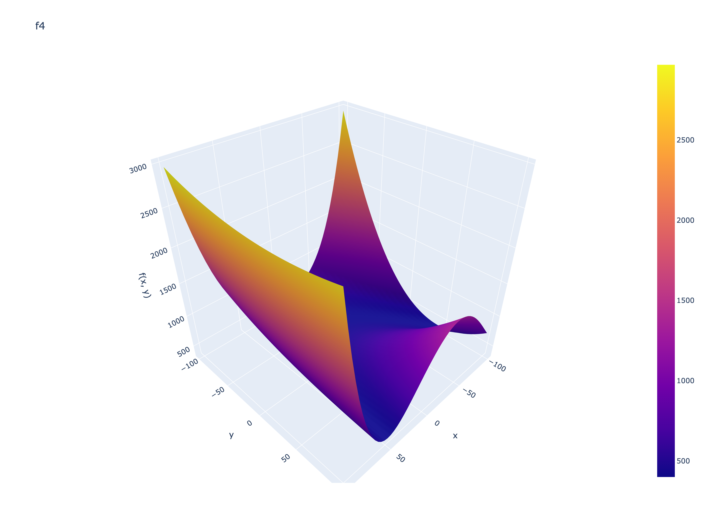
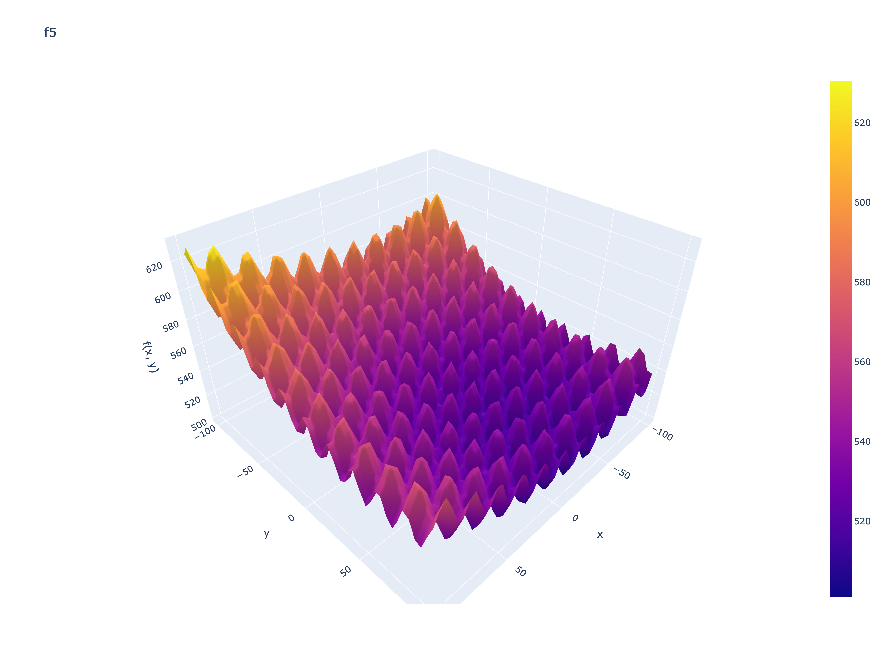
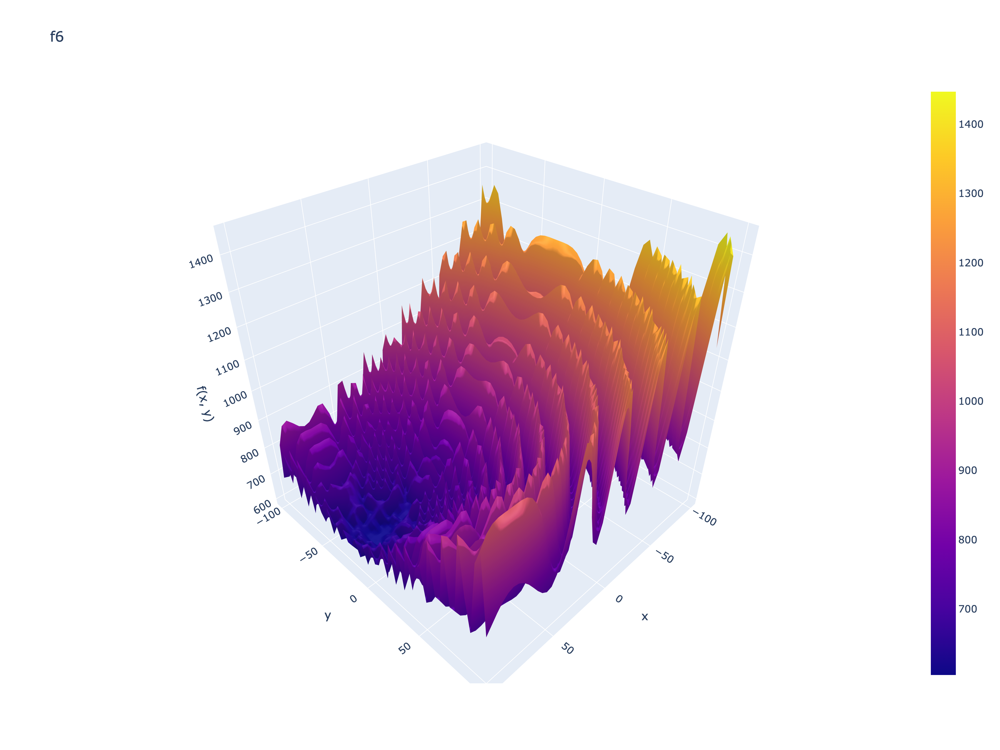
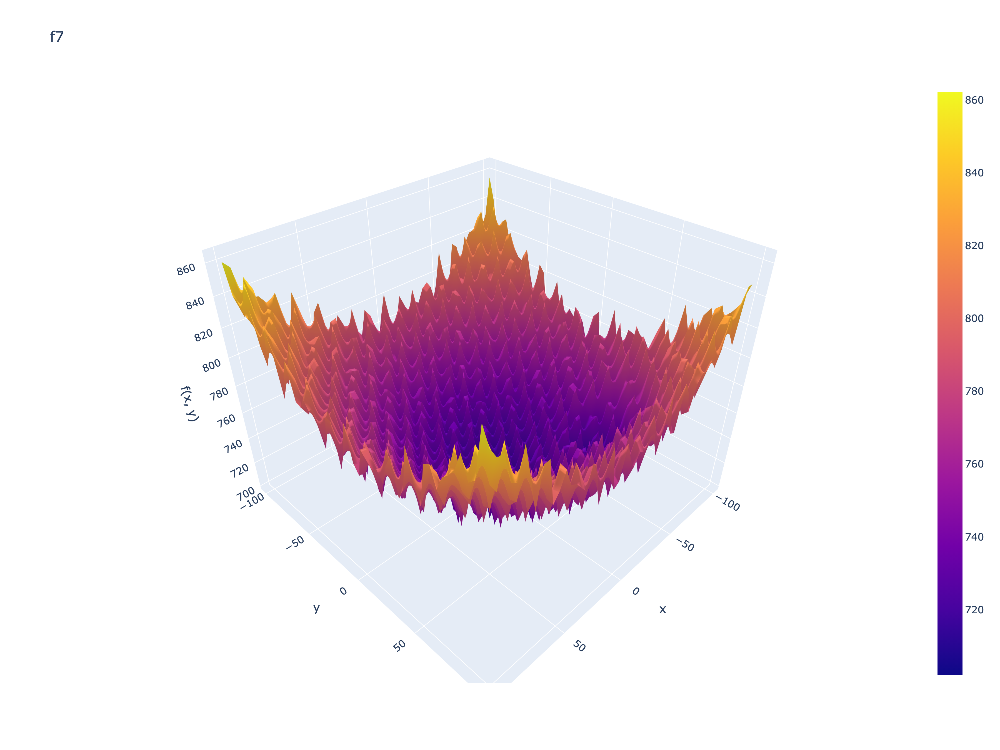
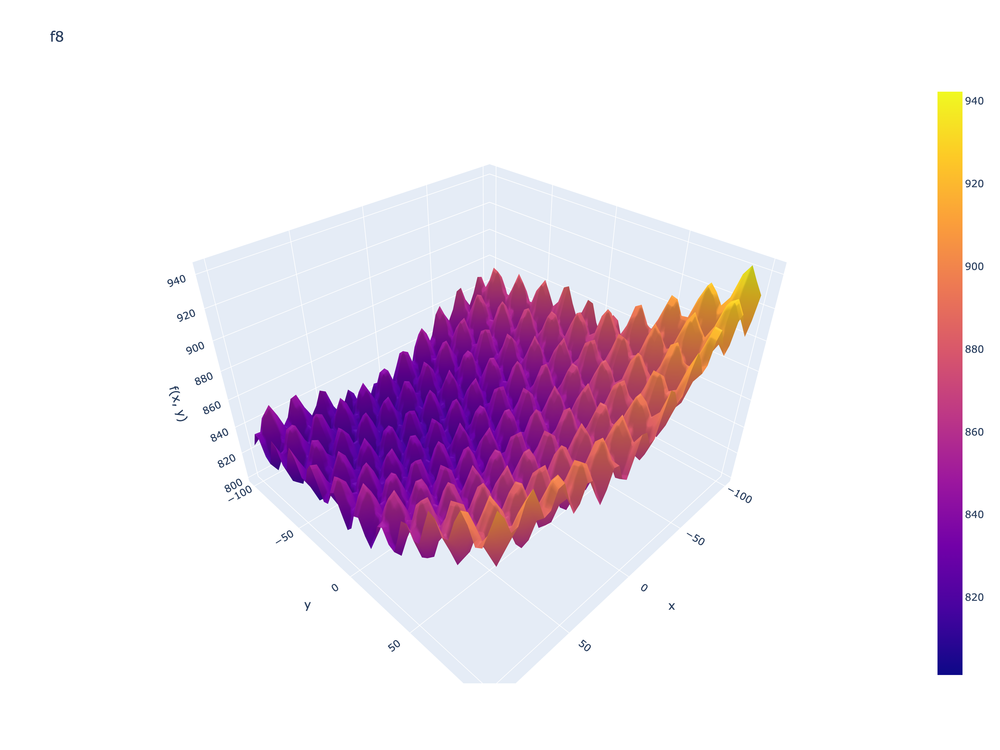
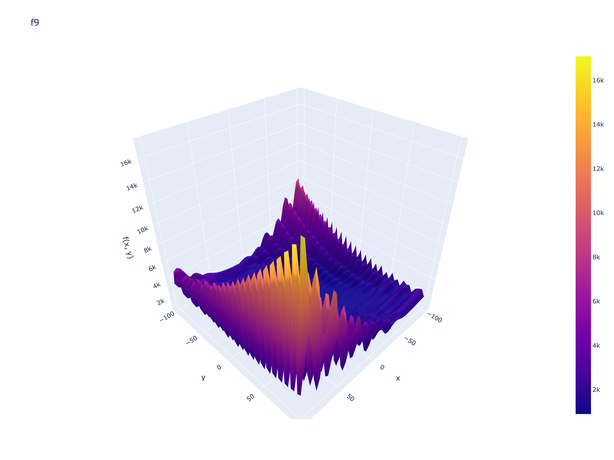
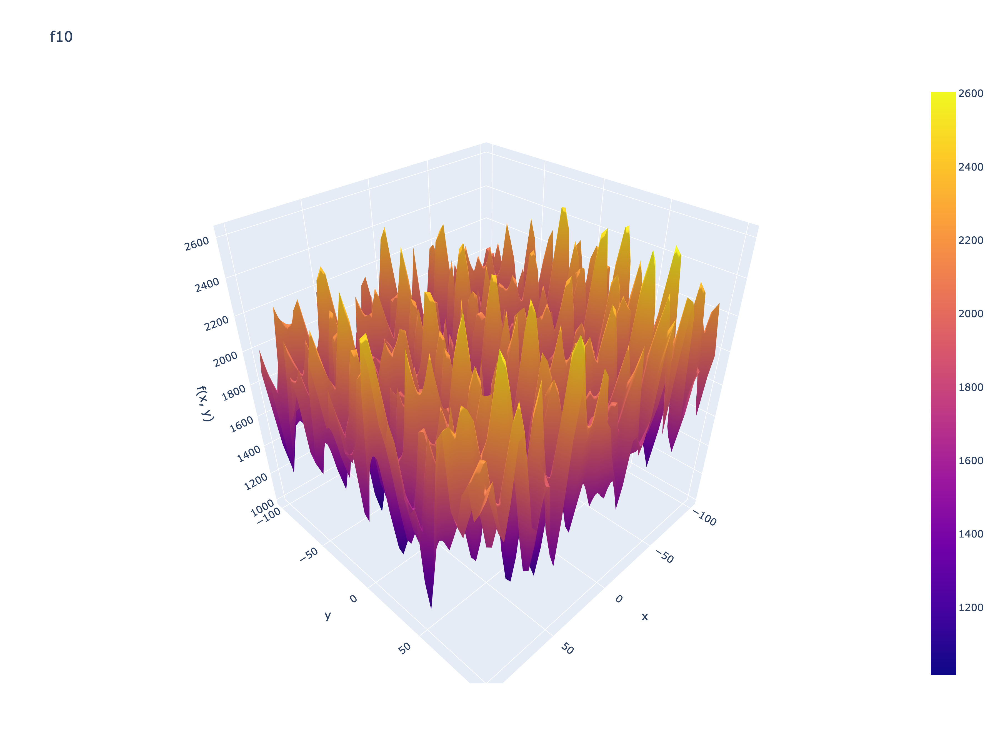

# CEC-2017 Optimization Research

Comparative study of numerical optimization methods on the [CEC-2017](https://github.com/P-N-Suganthan/CEC2017-BoundContrained) single-objective bound-constrained benchmark suite. The benchmark is provided by [cec2017-py](https://github.com/tilleyd/cec2017-py); this repository implements reproducible experiments (visualization, classical and metaheuristic optimizers, statistical comparison) with a clean Python package layout and `uv` for dependency management.

---

## Stage 1: CEC-2017 benchmark visualization

**Interactive f1-f10 explorer:** [https://lopa10ko.github.io/cec2017-optimization-research/cec_f1_f10.html](https://lopa10ko.github.io/cec2017-optimization-research/cec_f1_f10.html)


**Static gallery (f1–f10):**

| | |
|:---:|:---:|
|  |  |
|  |  |
|  |  |
|  |  |
|  |  |

---

## Stage 2: SciPy optimization

### Goal

Evaluate a classical **gradient-based** method on the full CEC-2017 set (f1–f28) at $D = 10$. SciPy’s bound-constrained solver exploits local curvature but is sensitive to starting points on multimodal landscapes—this baseline motivates population-based methods in Stage 3.

### Method

- **Optimizer:** `scipy.optimize.minimize` (no `method` set — SciPy chooses automatically)
- **Default method with bounds:** If `method` is not given, SciPy selects one of `BFGS`, `L-BFGS-B`, or `SLSQP` depending on whether the problem has constraints or bounds ([`scipy.optimize.minimize`](https://docs.scipy.org/doc/scipy/reference/generated/scipy.optimize.minimize.html)). We pass `bounds` on $[-100, 100]^{10}$, so the solver is bound-constrained (typically `L-BFGS-B`).
- **Initial point:** uniform random in bounds, independent per run
- **Runs:** 10 per function (`run_1` … `run_10`)
- **`maxiter`:** 1000 (SciPy option)

### Results

Full table (columns = functions, rows = runs, values = $f_{\min}$):

|  | f1 | f2 | f3 | f4 | f5 | f6 | f7 | f8 | f9 | f10 | f11 | f12 | f13 | f14 | f15 | f16 | f17 | f18 | f19 | f20 | f21 | f22 | f23 | f24 | f25 | f26 | f27 | f28 |
|---|---|---|---|---|---|---|---|---|---|---|---|---|---|---|---|---|---|---|---|---|---|---|---|---|---|---|---|---|
| run_1 | 100.0004 | 200.0009 | 300.0 | 400.0 | 662.3093 | 704.6189 | 1442.9286 | 979.0891 | 10417.9501 | 2811.0048 | 1177.6057 | 1812.0684 | 1445.7457 | 1633.5086 | 1609.0607 | 2434.4379 | 2388.7352 | 2466.1182 | 2250.9469 | 2613.139 | 2200.0 | 4603.0785 | 2815.6028 | 2602.3818 | 2902.1085 | 4271.3393 | 3136.9296 | 3411.8217 |
| run_2 | 100.0004 | 209.1306 | 300.0 | 400.0 | 833.2986 | 700.7381 | 1200.9894 | 1029.8302 | 5090.2973 | 3338.4494 | 1180.5899 | 1369.7181 | 1645.8412 | 1632.53 | 1678.9524 | 2257.3451 | 2391.2618 | 1853.0407 | 2839.1345 | 2522.2151 | 2481.891 | 3749.0648 | 3041.1373 | 2919.2976 | 2898.9288 | 5149.3704 | 3258.0082 | 3383.734 |
| run_3 | 100.0004 | 200.0001 | 300.0 | 400.0 | 802.4532 | 704.9132 | 1406.6116 | 956.206 | 3220.9456 | 2664.817 | 1266.1528 | 2008.2948 | 1452.506 | 1554.8259 | 1700.4586 | 2182.1185 | 2418.9511 | 1880.8816 | 4085.0087 | 2689.8284 | 2411.471 | 5534.0681 | 2824.008 | 2872.1992 | 2949.637 | 5228.7909 | 4743.5226 | 3383.734 |
| run_4 | 100.0004 | 200.0 | 300.0 | 400.0 | 836.2838 | 701.6595 | 1020.0732 | 886.5608 | 2678.2409 | 3459.2754 | 1233.322 | 1211.3828 | 1406.6631 | 1575.5459 | 1746.6966 | 1941.748 | 2001.1968 | 2219.762 | 2685.3209 | 2577.088 | 2352.7919 | 4977.8428 | 2750.2136 | 2789.0663 | 3559.353 | 4734.272 | 3173.4065 | 3383.7451 |
| run_5 | 100.0004 | 200.0008 | 300.0 | 400.0 | 599.863 | 720.0576 | 1177.9601 | 943.2725 | 3000.6402 | 2538.5198 | 1121.889 | 1939.0448 | 1361.4599 | 1520.5382 | 1557.5034 | 2544.4213 | 2277.5899 | 1959.4017 | 2184.1302 | 2261.7582 | 2532.4126 | 3071.7585 | 2982.7987 | 2897.6029 | 2901.174 | 2800.0 | 4200.6835 | 3100.0 |
| run_6 | 100.0004 | 200.0 | 300.0 | 400.0 | 645.2618 | 674.7441 | 957.3308 | 953.5013 | 5155.2464 | 2284.4292 | 1218.3958 | 1930.8104 | 1844.9729 | 1470.7583 | 1607.1074 | 2155.4426 | 2672.189 | 2079.0408 | 2028.843 | 2642.9683 | 2598.7396 | 3694.9516 | 2777.9771 | 2968.2634 | 2950.0635 | 4741.0621 | 3185.8504 | 3100.0 |
| run_7 | 100.0002 | 201.7997 | 300.0 | 400.0 | 629.3423 | 730.8845 | 1598.2888 | 1005.9465 | 4583.1878 | 2732.473 | 1201.3007 | 1675.1014 | 1688.684 | 1651.1178 | 1707.6308 | 2371.7198 | 2539.0697 | 1901.6159 | 3865.5965 | 2578.5526 | 2385.1101 | 4461.3355 | 2886.8922 | 2813.5585 | 3024.3697 | 4554.9307 | 3101.9154 | 3411.8217 |
| run_8 | 100.0002 | 200.0 | 300.0 | 400.0 | 887.0134 | 723.7242 | 871.5987 | 913.4243 | 3768.1008 | 2619.0281 | 1139.7978 | 1921.3303 | 1647.7109 | 1466.7787 | 1559.8128 | 2160.8373 | 1828.7804 | 1901.1606 | 1964.6908 | 2814.2973 | 2482.1836 | 4238.6681 | 3693.7436 | 2992.2682 | 2949.5332 | 4892.4675 | 3102.0291 | 3383.734 |
| run_9 | 100.0004 | 200.0001 | 300.0 | 400.0 | 699.9815 | 691.6342 | 1931.0726 | 922.377 | 1534.2169 | 2781.2796 | 1121.889 | 1701.4264 | 1972.1477 | 1444.1481 | 1981.5941 | 2124.6153 | 2174.3836 | 2199.1343 | 3982.3376 | 2389.0576 | 2437.6002 | 4580.7875 | 4117.006 | 2923.6317 | 2944.8614 | 4343.9078 | 3459.0574 | 3411.8217 |
| run_10 | 100.0004 | 200.0 | 300.0 | 400.0 | 935.7509 | 686.0224 | 1395.2464 | 944.2673 | 7425.4635 | 2630.3973 | 1165.6665 | 1555.5581 | 1524.4745 | 1582.3305 | 1542.2915 | 2407.5692 | 2312.6976 | 1913.651 | 1930.8493 | 2649.2601 | 2542.3558 | 2308.6549 | 2788.3279 | 2601.5299 | 2899.585 | 5039.0695 | 3503.5797 | 3411.8217 |

CSV: [outputs/stage2/scipy_fmin.csv](outputs/stage2/scipy_fmin.csv)

Unimodal functions (f1–f4) show stable $f_{\min}$ across runs; hybrid and composition functions (e.g. f9, f22, f26) exhibit larger run-to-run spread, reflecting sensitivity to random restarts.

---

## Stage 3: PSO and GA (planned)

PySwarms GlobalBestPSO and DEAP/PyGAD genetic algorithms; timing and boxplots under `outputs/stage3/`.

---

## Stage 4: Statistical comparison (planned)

Nemenyi post-hoc test across methods from Stages 2–3; figures under `outputs/stage4/`.

---

## Project structure

Layout adapted from the [cookiecutter-research-project](https://github.com/aeturrell/cookiecutter-research-project) data-science template. Included paths match this study; empty template folders (`data/`, `logs/`, `models/`, `paper/`) are omitted because artifacts live under `outputs/` and the benchmark is installed as a dependency.

```text
cec2017-optimization-research/
├── pyproject.toml
├── README.md
├── notebooks/
│   └── experiments.ipynb
├── outputs/
│   ├── stage1/                 # 3D surface plots (Stage 1)
│   ├── stage2/                 # SciPy minimize tables
│   ├── stage3/                 # PSO / GA tables + boxplots (planned)
│   └── stage4/                 # Nemenyi test outputs (planned)
└── src/
    └── cec2017/
        ├── benchmark/
        ├── visualization/
        └── optimization/
```

## Reproducibility

Requires [uv](https://docs.astral.sh/uv/).

```bash
cd cec2017-optimization-research
uv venv
source .venv/bin/activate   # Windows: .venv\Scripts\activate
uv sync

# then go to notebooks/experiments.ipynb
# or run via:
uv run jupyter notebook notebooks/experiments.ipynb
```

---

## License

See [LICENSE](LICENSE).
